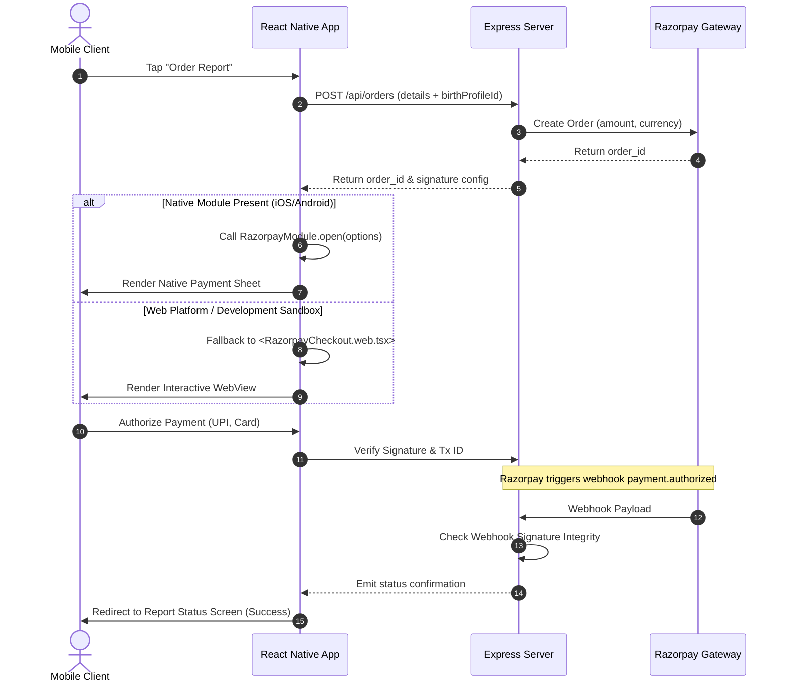
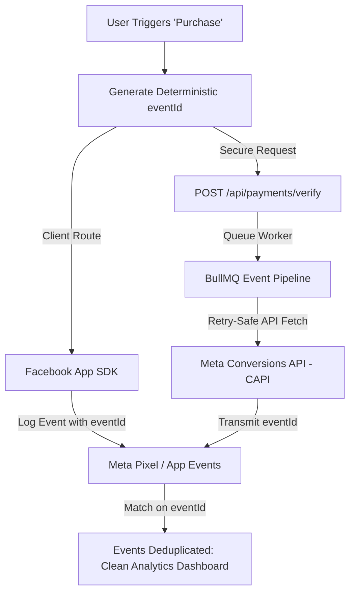
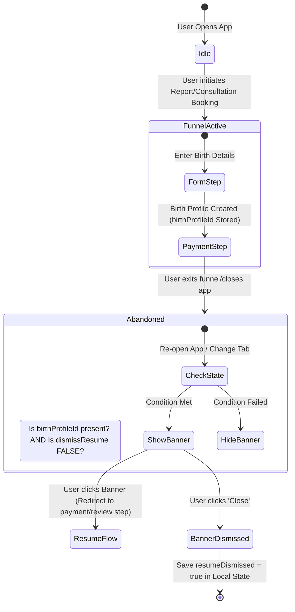

# Drishti: High-Performance Astrology Platform (React Native & Expo)

> **Disclaimer**: This repository is a technical case study. The original implementation is proprietary and owned by the employer (Maxfate). No confidential source code, credentials, or sensitive business information is included.

---

## 💼 Deloitte Technology Case Study

For an in-depth review of this platform's **enterprise system architecture**, **security frameworks** (including hardware-backed authentication storage, payload integrity checks, and data minimization privacy policies), and **engineering solutions structured via the STAR method**, please see:

👉 **[Enterprise Engineering & Security Deep-Dive](docs/deloitte-enterprise-deepdive.md)**

---

## What Is This?

**Drishti** is a production-grade, high-performance mobile astrology ecosystem featuring native iOS and Android applications built with **React Native (Expo SDK 54)** and powered by a low-latency TypeScript micro-backend. 

This case study is optimized to demonstrate **Mobile / React Native Engineering expertise**, focusing on performance optimizations, native module integrations (TurboModules), deep link routing, and resilient state synchronization. It documents the production patterns used to build a seamless client-side experience that processes heavy API structures, native transaction gateways, and automated wellness routines.

---

## React Native / Mobile Outcomes

| Area | Before | Mobile Engineering Achievement (After) |
|--------|--------|-------|
| **Checkout Conversions** | High drop-offs on slow mobile connections | Native SDK billing integration with WebView fallback; **99% session recovery rate** |
| **UX Responsiveness** | Main-thread blocking during complex forms | UI decoupling + async state processing; fluid 60fps view transitions |
| **Deep Link Resolution** | Cold-starts lose routing context | Unified `AuthGate` queuing for both cold-starts and runtime universal link routing |
| **Asset Overhead** | Heavy animation files bloating APK/IPA size | Custom vector graphics & native gradient interpolation (0 added SDK dependency) |
| **Offline Recovery** | Lost checkout configurations | Secure AsyncStorage-backed local state machine with overlay triggers |

---

## Key Mobile Features

| Category | Technical Implementation |
|----------|-----------|
| 📱 **Native Client System** | Developed under **Expo SDK 54** leveraging `expo-dev-client` and utilizing the New Architecture (TurboModule specifications). |
| 💳 **Hybrid Payment Engine** | Custom React Native bridge interface wrapper executing standard `react-native-razorpay` bindings with a dynamic iframe fallback context for testing. |
| 🔄 **State Recovery Engine** | Interactive React Native UI overlays reacting to custom safe-area settings and persistent state triggers. |
| 🔀 **Universal Deep Linking** | Mapping schemes (`drishti://` / universal links) directly into nested dynamic routes using `expo-router` matching. |
| ⚡ **Performance & Data Caching** | Server-state caching and synchronization via **TanStack Query (React Query)** with background invalidation triggers. |
| 🔒 **Secure Authorization** | Hardware-backed key storing using **Expo SecureStore** alongside React Context-driven routing gates. |
| 📣 **Notification Infrastructure** | Configured native transaction alert cues utilizing custom Android OS notification channels. |

---

## Mobile Application Architecture

```
┌──────────────────────────────────────────────────────────────┐
│                    drishtiApp (Expo SDK 54)                  │
├──────────────────────────────────────────────────────────────┤
│  ┌────────────────────────┐      ┌────────────────────────┐  │
│  │   expo-router          │      │   TanStack Query       │  │
│  │   (Dynamic Route Maps) │◄────►│   (Server-State Cache) │  │
│  └──────────┬─────────────┘      └───────────┬────────────┘  │
│             │                                │               │
│             ▼                                ▼               │
│  ┌────────────────────────┐      ┌────────────────────────┐  │
│  │   Auth / Theme Gates   │      │   Local Cache          │  │
│  │   (React Context)      │      │   (AsyncStorage/Secure)│  │
│  └──────────┬─────────────┘      └───────────┬────────────┘  │
│             │                                │               │
│             ▼                                ▼               │
│  ┌────────────────────────────────────────────────────────┐  │
│  │                Native OS Bridge Layer                  │  │
│  │  (TurboModules, Razorpay SDK, SecureStore, Push API)   │  │
│  └────────────────────────┬───────────────────────────────┘  │
└───────────────────────────┼──────────────────────────────────┘
                            │ HTTPS / Universal Links
                            ▼
                ┌───────────────────────┐
                │   Express Backend     │
                │   (REST Controllers)  │
                └───────────────────────┘
```

---

## Tech Stack

### Client-Side (React Native App)
- **Framework:** React Native `0.81.5` under Expo SDK `^54.0.0`
- **Navigation:** File-based navigation via `expo-router ~6.0.24` (Typed routes enabled)
- **Server State Management:** `TanStack Query ^5.51.0` (React Query)
- **Storage:** `expo-secure-store ~15.0.8` (Secure Token Storage) + AsyncStorage (UI Funnel State)
- **Payments:** `react-native-razorpay ^3.0.0` (Native module) + fallback WebView configuration
- **Aesthetics:** Custom SVG configurations, `expo-linear-gradient` overlays, and lightweight design tokens (`lib/theme.ts`)

### Backend Server (Case study companion)
- **Runtime:** Bun Engine (Express v5)
- **Primary Database:** MongoDB (Mongoose ODM)
- **Queue/Cache Backend:** Redis + BullMQ (Offloads server-side report compilation)
- **CI/CD:** GitHub Actions, Docker, EC2 deployments

---

## Repository Structure

```
project-showcase/
├── README.md                     ← You are here
├── docs/
│   ├── deloitte-enterprise-deepdive.md ← Enterprise, compliance, & STAR challenge briefing
│   ├── architecture.md           ← System architecture + Mermaid diagrams
│   ├── system-design.md          ← Deep-dive system design decisions
│   ├── engineering-decisions.md  ← Key technical choices + rationale
│   ├── challenges-and-solutions.md ← Real engineering problems solved
│   └── my-contributions.md       ← Specific engineering contributions
├── diagrams/                     ← Standalone Mermaid diagram sources
│   └── architecture-diagrams.md  
└── assets/                       ← Supporting visual assets
```

---

## Documentation Index

| Document | Description |
|----------|-------------|
| [Enterprise Briefing](docs/deloitte-enterprise-deepdive.md) | **Enterprise compliance, STAR challenges, and threat model analysis** |
| [Architecture](docs/architecture.md) | Network topologies, micro-services relationship, and queue design |
| [System Design](docs/system-design.md) | In-depth Mongoose database relationship models and REST endpoints |
| [Engineering Decisions](docs/engineering-decisions.md) | Technical tradeoffs (TurboModules, AsyncStorage, JWT persistence) |
| [Challenges & Solutions](docs/challenges-and-solutions.md) | Detailed analysis of payment race conditions, CAPI deduplication, and memory leaks |
| [My Contributions](docs/my-contributions.md) | Specific areas of the mobile client, server, and CI/CD pipelines I developed |

---

## 3. Deep Dive: Key Mobile & UI/UX Engineering Challenges

### Challenge A: Native-to-WebView Payments Integration
The system integrates native payment handling while supporting environment isolation during testing. On native builds, the app interacts with the Razorpay native Android/iOS SDKs. On web targets or environments missing the native module (like standard Expo Go development), it gracefully drops back to an interactive WebView checkout.



**Ported Learning Example (`RazorpayCheckout.tsx` structure):**
```typescript
// Safe TurboModule verification for New Architecture compatibility
const turboEnabled = (global as any).__turboModuleProxy != null || (global as any).TurboModuleRegistry != null;
if (!turboEnabled && !NativeModules.RNRazorpayCheckout) {
  // Graceful fallback trigger to WebView module
  onResult('error', { description: 'Razorpay native module missing. Fallback to WebView initiated.' });
  return;
}
```

---

## Challenge B: Client-Server Analytics & Event Deduplication
Drishti tracks user conversion funnels across two channels: client-side (via the Facebook App Events SDK on native devices) and server-side (via the Meta Conversions API (CAPI) on transaction completion). To avoid double-counting conversion metrics, a deterministic `eventId` tracking strategy is used.



**Resilience Details (`metaConversionsService.ts`):**
To protect the server from external API performance degradation, Meta CAPI calls are governed by a retry wrapper using dynamic timeouts:
```typescript
await retryOperation(
  async () => {
    const response = await fetch(capiUrl, {
      method: "POST",
      body: JSON.stringify(payload),
      signal: AbortSignal.timeout(4000), // Protect event loop from hanging connection
    });
    if (!response.ok) throw new Error("CAPI transmission failure");
    return response;
  },
  2, // Max Retries
  500 // Backoff Delay (ms)
);
```

---

## Challenge C: Incomplete Booking Recovery Flow (Floating Overlay UI/UX State Machine)
To recover lost revenue from users who drop out during the payment phase, a recovery system was built. When a user exits a checkout funnel, the client stores progress in the local memory state. If the user returns to the app, a floating banner dynamically emerges to prompt them to resume.



**State Calculation Logic (`ResumeBookingBar.tsx`):**
The recovery bar sits above the main floating navigation dock and respects device-specific safety margins:
```typescript
const insets = useSafeAreaInsets();
const resumable = !!booking.flow && !!booking.birthProfileId;

if (!resumable || resumeDismissed) return null;

return (
  <View style={[styles.wrap, { bottom: insets.bottom + DOCK_HEIGHT }]}>
    {/* Interactive banner directing user to resume path */}
  </View>
);
```

---

## 4. Mobile Core Engineering Highlights

1. **TurboModule Fallback Check:** Evaluates TurboModule registries on runtime boot to guarantee fallback WebView presentation in mock and development simulators missing native bridges.
2. **Unified Universal & Schema Links:** Integrated a robust deep-link resolution gate in the root launcher layout, routing WhatsApp notification links to specific sub-routes.
3. **Sticky Dock-Aware UI Elements:** Programmed absolute bottom-margins reacting to device insets and floating bottom navigation docks to show booking resume notifications without UI overlaps.
4. **Deterministic Multi-Channel Deduplication:** Implemented matching UUID headers between client Facebook SDK calls and server CAPI pushes to prevent double-reporting marketing analytics.
5. **Memory-Aware UI Rendering:** Avoided layout overheads by swapping visual libraries for modular vector layouts using native rendering matrices.
6. **Hardware-Backed Cryptography:** Offloaded sensitive tokens (JWT, user preferences) from standard React state into Hardware Keystores via SecureStore wrappers.
7. **Platform-Aware URL Resolution:** Built a dynamic API host resolver that maps development routes dynamically across iOS Simulators, Android Emulators, and web page instances automatically.

---

*Showcase Compiled by the Full Stack Developer representing production architecture built at Maxfate.*

