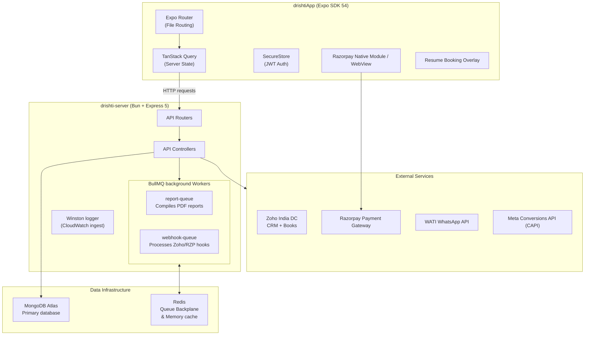
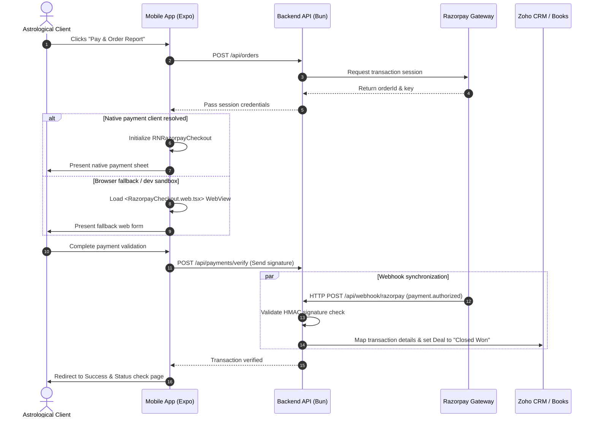
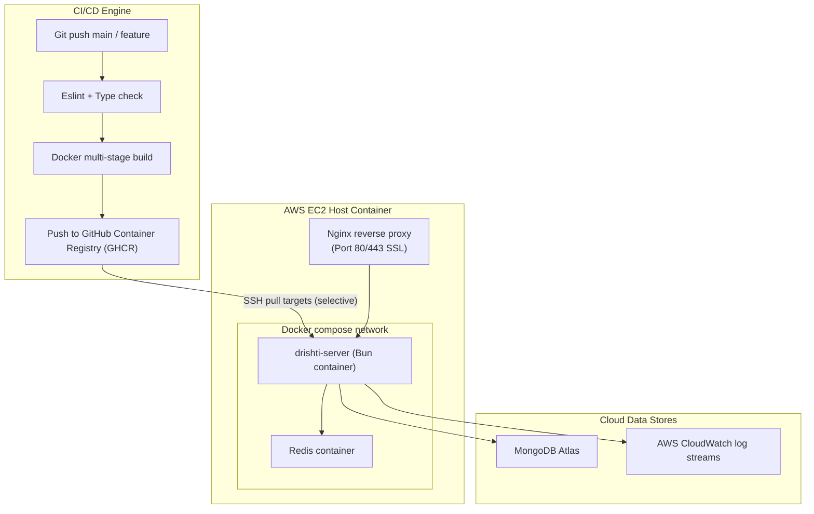

# System Architecture

> **Disclaimer**: This repository is a technical case study. The original implementation is proprietary and owned by the employer. No confidential source code, credentials, or sensitive business information is included.

---

## 1. High-Level System Architecture

Drishti connects mobile client wrappers to a high-performance backend, orchestrating background processing queues and external services.

---

## 2. Inbound/Outbound Payment Verification Flow

Transactions follow a strict client-verification check paired with asynchronous webhooks to ensure Zoho CRM records update even on flaky mobile connections.

---

## 3. Deployment Topology

