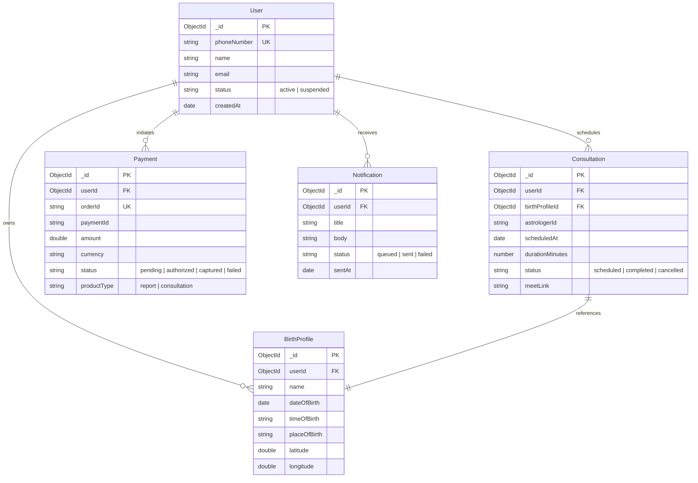

# System Design

> **Disclaimer**: This repository is a technical case study. The original implementation is proprietary and owned by the employer. No confidential source code, credentials, or sensitive business information is included.

---

## 1. Database Schema Specifications

The backend server manages relational mapping using MongoDB via Mongoose. The database stores transaction records, user authentication data, consultation slots, and notification preferences.

---

## 2. API Interface Schema

### REST Endpoints

#### Authentication Flow
* **`POST /api/mobile/auth/login`**: Initiates OTP challenge.
  * Request: `{ "phoneNumber": "+91XXXXXXXXXX" }`
* **`POST /api/mobile/auth/verify`**: Validates OTP and sets authentication headers.
  * Request: `{ "phoneNumber": "+91XXXXXXXXXX", "code": "123456" }`
  * Response: `{ "token": "JWT_TOKEN", "user": { "_id": "...", "name": "..." } }`

#### Payments
* **`POST /api/orders`**: Configures transaction order settings with Razorpay.
  * Request: `{ "productType": "report", "productId": "career_report_2026" }`
  * Response: `{ "orderId": "order_xyz", "amount": 99900 }`
* **`POST /api/payments/verify`**: Validates Razorpay client signature.
  * Request: `{ "orderId": "order_xyz", "paymentId": "pay_abc", "signature": "sha256_hash" }`
  * Response: `{ "status": "success" }`

#### Consultations
* **`GET /api/mobile/consultations/slots`**: Queries database for expert slot schedules.
  * Params: `?astrologerId=X&date=2026-07-01`
  * Response: `[ { "slotStart": "10:00", "slotEnd": "10:30", "available": true } ]`

